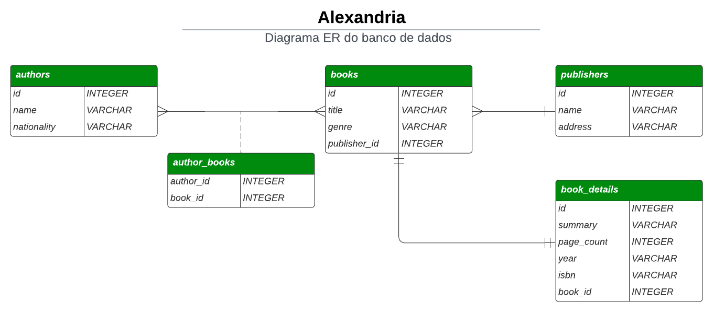
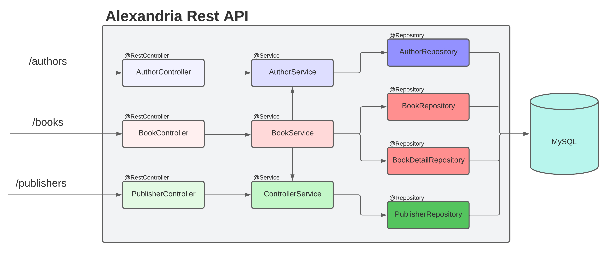

# alexandria
Projeto API Rest Alexandria

O foco do dia é trabalhar a persistência de dados com o Spring Data JPA e, com a intenção de ajudar a manter o foco, iremos trabalhar em uma API Rest de persistência de livros a qual chamaremos de Alexandria em referência a Biblioteca de Alexandria.

Você construirá o projeto do zero e no dia de hoje, você se concentrará em configurar o Spring Data JPA e a mapear as tabelas do banco de dados com as classes Java que representam as entidades de domínio da API Rest.

Hoje você não realizará os relacionamentos entre tabelas e, ao iniciar o desenvolvimento, pode parecer estranho. Contudo tenha em mente que isso é intencional e que posteriormente você trabalhará apenas na definição dos relacionamentos 1:1, 1:N e N:N.

Mas para lhe dar visibilidade de como será a API Rest Alexandria segue o Diagrama de Entidade Relacionamento (DER) do banco de dados com seus respectivos relacionamentos.

A figura a seguir lhe ajudará a entender como os componentes irão se comunicar entre si.

Logo, nossa expectativa é que você consiga ter uma visão completa de como os componentes da API Rest Alexandria comunicam-se entre si, facilitando sua compreensão e aprendizado do conteúdo.
